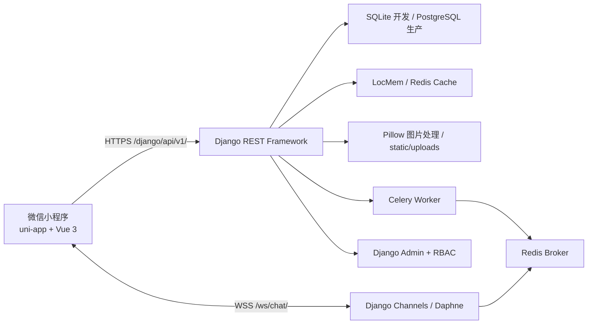

# Local Flavor 项目审计与开发文档

> 文档基线：2026-07-28。本文以仓库真实代码和可执行验证结果为准，适用于接手开发、联调、测试与部署。

## 1. 项目概述

Local Flavor 是面向微信小程序的 C2C 地方特产交换平台。核心业务闭环为：

```text
登录与定位 -> 发布特产 -> 内容审核 -> 发现与推荐 -> 发起交换
-> 私聊协商 -> 完成交换 -> 解锁社区发帖/评论 -> 形成内容沉淀
```

当前生产主线由以下两部分组成：

- `backend_django/`：Django REST API、管理后台、Celery 任务和 WebSocket。
- `frontend/uni-app/`：Vue 3 + uni-app 微信小程序前端。

`localtreasure---特产交换/` 及其 ZIP 是早期 React/AI Studio 原型，使用 Mock 数据与 LocalStorage，不与当前 Django 主线联通，不应作为生产前端部署。

## 2. 总体架构



### 2.1 技术栈基线

| 层级 | 技术 |
|---|---|
| 后端生产基线 | Python 3.12、Django 5.2 LTS、Django REST Framework 3.x |
| BAS-03 验证环境 | 本地 Python 3.12.12、Django 5.2.16；PR #4 已通过 merge commit `e3063ac` 合并到 `main`，最终 run `30473785222` / head `d3b32c0` 的 4 个 checks 均为 success |
| 数据库 | SQLite（开发）、PostgreSQL（生产） |
| 缓存 | Django LocMemCache 或 RedisCache |
| 异步任务 | Celery + Redis |
| 实时通信 | Django Channels + channels-redis + Daphne |
| 前端 | DCloud 5.15、uni-app Vue 3.4.21、Vite 5.2.8、Pinia 2、TypeScript 5.4 |
| 图片 | Pillow，上传后统一限制尺寸并转换为 JPEG |
| 管理后台 | Django Admin、Group/Permission RBAC |

## 3. 目录说明

```text
local_flavor/
├─ backend_django/              Django 主后端
│  ├─ config/                   settings、URL、ASGI、WSGI、Celery
│  ├─ core/                     鉴权、缓存、日志、异常、CORS、定位
│  ├─ users/                    用户、地区、偏好快照
│  ├─ items/                    特产、审核、推荐
│  ├─ interactions/             特产评论、风味标签/投票
│  ├─ exchange/                 交换请求状态机
│  ├─ messaging/                会话、消息、系统通知、WebSocket
│  ├─ community/                社区帖子、评论、点赞、审核
│  ├─ system_config/            运营枚举配置
│  ├─ stats/                    地区统计与地图数据代理
│  └─ uploads/                  图片上传
├─ frontend/uni-app/            当前微信小程序前端
├─ docs/                        方案、部署和本审计文档
├─ static/uploads/              用户上传文件（不应提交 Git）
├─ requirements.in              经审查的 Django 直接运行依赖
├─ requirements.lock            CI/生产精确传递依赖与分发哈希
├─ requirements.txt             标准兼容入口，引用 requirements.lock
├─ localtreasure---特产交换/    早期 React 原型
└─ localtreasure---特产交换.zip 早期原型归档，存在安全风险，见第 13 节
```

## 4. 后端模块职责

| 模块 | 主要模型/职责 |
|---|---|
| `users` | `LocalUser`、`Region`、`UserPreferenceSnapshot`；微信/手机号登录、地区更新 |
| `items` | `Item`；发布、审核、列表、详情、今日上新、推荐打分 |
| `interactions` | `Comment`、`FlavorTag`、`FlavorVote`；同地区评论与风味投票 |
| `exchange` | `ExchangeRequest`；交换请求及状态流转 |
| `messaging` | `Conversation`、`ConversationMember`、`ChatMessage`；私聊、未读数、系统消息 |
| `community` | `CommunityPost`、`CommunityComment`、`CommunityPostLike`；交换后社区内容 |
| `system_config` | `SystemOption`；分类、季节、保质期、便携度 |
| `stats` | 公开特产地区统计、地图 GeoJSON 代理 |
| `uploads` | 登录用户图片校验、压缩、落盘 |
| `core` | Token、统一响应、异常、缓存版本、请求日志、CORS、微信与逆地理编码 |

## 5. 关键业务规则

### 5.1 鉴权

- 微信登录通过 `code2session` 获取 `openid`。
- 手机号登录使用 Django 密码哈希校验。
- AUTH-01A 登录顶层 `access_token/token` 保持旧签名语义；新客户端从明确的 `session` 对象读取短期 opaque access 与 refresh，数据库只保存 SHA-256 摘要，不保存明文凭据。
- access 默认有效期 15 分钟，会话家族绝对有效期默认 30 天且刷新不滑动；refresh 历史摘要支持重放识别，发现已使用凭据会撤销整个家族。
- DRF 自定义 `BaseAuthentication` 将 `LocalUser` 与 `AuthSession` 写入 `request.user/request.auth`，REST 与 WebSocket 共用同一解析器。
- 生产环境缺省兼容开关会拒绝启动；稳态必须显式配置 legacy/query 为 `0`，AUTH-01A 迁移部署则显式配置有界的 `1` 与不超过 90 天的 UTC 截止时间，query fallback 会在截止时间自动停止。

请求头：

```http
Authorization: Bearer <token>
```

### 5.2 地区与发布

- 用户可手动提交省市，或提交经纬度执行逆地理编码。
- 地区修改存在 30 天冷却期。
- 发布特产时，后端忽略客户端传入的地区，强制绑定用户当前地区。
- 特产创建后为 `pending`，Celery 审核任务将其改为 `approved` 或 `rejected`。
- 未审核、已拒绝或隐藏特产不会出现在公开列表、公开评论和公开统计中。

### 5.3 推荐

登录用户首页优先请求 `/items/recommended`。当前使用规则打分：

```text
风味偏好 35% + 类别偏好 20% + 季节 15% + 地区 10%
+ 发布者交换经验（已完成交换数量）10% + 新鲜度 10%
```

偏好来源包括风味投票、用户已发布类别、已完成交换涉及的类别/标签/地区。推荐失败时前端降级为普通特产列表。

### 5.4 交换状态机

```text
pending --拥有者同意--> accepted --任一参与者确认--> completed
   |                         
   +--拥有者拒绝--> rejected
   +--请求者取消--> cancelled
```

`rejected`、`cancelled`、`completed` 为终态；不允许状态回退或重复流转。

### 5.5 聊天与系统通知

- 两个用户按 `participant_low + participant_high + context_key` 唯一确定会话。
- 消息使用会话内递增 `seq` 排序。
- `client_msg_id` 用于客户端消息幂等。
- 普通客户端只能发送 `text`、`item_card`、`image`。
- `system` 消息只能由后端 `send_system_notice()` 创建。
- WebSocket 不可用时，小程序每 5 秒通过 REST 拉取最新消息。

### 5.6 社区权限

- 只有完成过交换的用户才能围绕相关特产发帖。
- 只有参与过该特产已完成交换的用户才能评论对应帖子。
- 帖子和评论经过 Celery 审核后才公开。
- 点赞、评论、回复、审核结果和首次完成交换会产生系统通知。
- 社区列表支持 `latest` 与 `hot` 排序。

## 6. API 约定

### 6.1 基础地址

```text
开发：http://127.0.0.1:8001/django/api/v1
生产：https://<正式域名>/django/api/v1
管理后台：/django/admin/
WebSocket：/ws/chat/conversations/<conversation_id>/，标准认证使用 Authorization: Bearer <token> 请求头
```

URL query `?token=` 只用于旧客户端的有界迁移 fallback，受生产显式开关与 UTC 截止时间约束，不是标准接入方式。

成功响应：

```json
{
  "code": 0,
  "message": "ok",
  "data": {}
}
```

失败响应通常包含 HTTP 状态码、`message`、`errors` 和 `request_id`。

### 6.2 接口清单

| 模块 | 方法与路径 | 说明 |
|---|---|---|
| 用户 | `POST /user/wx-login` | 微信登录 |
| 用户 | `POST /user/phone-login` | 手机号登录 |
| 用户 | `POST /user/session/refresh` | 轮换 opaque access/refresh |
| 用户 | `POST /user/session/logout` | 撤销当前会话 |
| 用户 | `GET /user/sessions` | 当前用户设备会话列表 |
| 用户 | `POST /user/sessions/<id>/revoke` | 撤销指定自有会话 |
| 用户 | `POST /user/sessions/revoke-others` | 撤销当前会话外的其他会话 |
| 用户 | `GET /user/me` | 当前用户 |
| 用户 | `PUT /user/region` | 更新地区 |
| 特产 | `GET/POST /items/` | 列表、发布 |
| 特产 | `GET /items/recommended` | 登录用户推荐 |
| 特产 | `GET /items/today-by-region` | 今日上新分地区聚合 |
| 特产 | `GET /items/<id>` | 特产详情 |
| 特产 | `POST /items/<id>/flavor` | 风味投票/取消/切换 |
| 评论 | `GET/POST /comments/<item_id>` | 特产本地评论树 |
| 交换 | `GET/POST /exchange/requests` | 查询、创建交换请求 |
| 交换 | `PUT/PATCH /exchange/requests/<id>/status` | 更新交换状态 |
| 聊天 | `GET /chat/conversations` | 会话列表 |
| 聊天 | `POST /chat/conversations/ensure` | 获取或创建会话 |
| 聊天 | `GET /chat/conversations/<id>/messages` | 消息历史 |
| 聊天 | `POST /chat/conversations/<id>/read` | 已读确认 |
| 聊天 | `POST /chat/messages` | 发送消息 |
| 社区 | `GET/POST /community/posts` | 社区列表、发帖 |
| 社区 | `GET/DELETE /community/posts/<id>` | 详情、软删除 |
| 社区 | `GET/POST /community/posts/<id>/comments` | 社区评论 |
| 社区 | `DELETE /community/posts/<id>/comments/<comment_id>` | 删除评论 |
| 社区 | `POST /community/posts/<id>/like` | 点赞切换 |
| 社区 | `GET /community/eligible-items` | 可发帖特产 |
| 配置 | `GET /options/` | 运营选项 |
| 统计 | `GET /stats/map` | 公开特产地区统计 |
| 统计 | `GET /stats/map-data` | 中国地图数据代理 |
| 上传 | `POST /upload/` | 登录用户上传图片 |

表中路径均相对于 `/django/api/v1`。

## 7. 环境配置

后端根据 `DJANGO_ENV` 自动加载：

- `backend_django/env.dev`
- `backend_django/env.pro`

仓库提供 `backend_django/env.pro.example`，生产部署时复制为 `env.pro` 后填写真实值。真实 `env.dev`、`env.pro` 不应提交 Git。关键配置组：

| 配置组 | 关键变量 |
|---|---|
| Django | `DJANGO_SECRET_KEY`、`DJANGO_DEBUG`、`DJANGO_ALLOWED_HOSTS` |
| 数据库 | `DB_ENGINE`、`DB_NAME`、`DB_USER`、`DB_PASSWORD`、`DB_HOST`、`DB_PORT` |
| 微信 | `WECHAT_APPID`、`WECHAT_SECRET` |
| 上传 | `UPLOAD_MAX_FILE_MB`、图片宽高、JPEG 质量 |
| 缓存 | `CACHE_BACKEND`、`CACHE_REDIS_URL`、各业务 TTL |
| 聊天 | `CHAT_ENABLE_WS`、`CHAT_REDIS_URL` 或拆分 Redis 参数 |
| Celery | `CELERY_BROKER_URL`、`CELERY_RESULT_BACKEND`、`CELERY_TASK_ALWAYS_EAGER` |
| 审核 | `ITEM_AUDIT_BANNED_WORDS`、`COMMUNITY_AUDIT_BANNED_WORDS` |
| CORS | `CORS_ALLOW_ALL_ORIGINS`、`CORS_ALLOWED_ORIGINS` |

前端使用：

```env
VITE_API_BASE_URL=http://127.0.0.1:8001/django/api/v1
VITE_CHAT_ENABLE_WS=1
```

## 8. 本地开发

### 8.1 后端

Windows PowerShell：

```powershell
cd D:\Code\local_flavor
py -3.12 -m venv venv
.\venv\Scripts\Activate.ps1
python -m pip install --require-hashes -r requirements.lock
python -m pip check

cd backend_django
$env:DJANGO_ENV = "dev"
python manage.py migrate
python manage.py seed_demo_data
python manage.py runserver 0.0.0.0:8001
```

开发环境若设置 `CELERY_TASK_ALWAYS_EAGER=1`，审核和偏好任务会在请求进程中同步执行。关闭 eager 后需要启动 worker：

```powershell
.\scripts\start_celery_worker.ps1
```

### 8.2 小程序前端

```powershell
cd D:\Code\local_flavor\frontend\uni-app
npm ci
npm run type-check
npm run dev:mp-weixin
```

然后在微信开发者工具中导入：

```text
frontend/uni-app/dist/dev/mp-weixin
```

### 8.3 演示账号

执行 `python manage.py seed_demo_data` 后：

```text
13800000000 / Test@123456
13800000001 / Test@123456
13800000002 / Test@123456
13800000003 / Test@123456
```

演示密码只能用于本地或隔离测试环境。

## 9. 测试与质量检查

后端：

```powershell
cd backend_django
python manage.py test
python manage.py check
python manage.py makemigrations --check --dry-run
python -m compileall -q .
```

前端：

```powershell
cd frontend\uni-app
npm run type-check
npm run build:mp-weixin
```

GitHub Actions 质量门禁的实现与真实 Actions 验证已完成；PR #3 已通过 merge commit `39a3cdb` 合并，`main` 当前已具备该工作流。GitHub PR #3 的最终 Actions run [`30450805118`](https://github.com/bo-ouyang/local_flavor/actions/runs/30450805118) 已在 head `491319a` 上验证通过，4 个 checks 均为 success。该工作流对指向 `main` 的 PR 与 `main` push 自动执行：

- 后端在 Python 3.12、PostgreSQL 16、Redis 7 环境运行全量测试、系统检查、迁移漂移检查和编译检查。
- 前端在 Node.js 22 环境通过 `npm ci` 安装锁定依赖，运行类型检查和微信小程序生产构建。
- 所有命令步骤显式使用 Bash，确保带 `tee` 的日志管道通过 `pipefail` 保留上游失败状态。
- TruffleHog 只检查本次 PR 或 push 新引入的秘密；扫描失败返回非成功状态。历史密钥的轮换与 Git 历史清理仍属于 BAS-01 外部维护任务。
- `pip-audit` 与 `npm audit` 生成可下载 JSON 报告。Python 3.12 当前解析基线为 0 个已知漏洞，因此 Python 审计发现漏洞时返回非成功状态；旧版 uni-app 基线为 11 low / 17 moderate / 42 high / 0 critical。npm 命令允许以漏洞退出码完成报告生成，随后由仓库内基线守卫在任一等级恶化、出现任何 critical、报告缺失、无效或结构异常时返回非成功状态。
- 后端或前端门禁失败时保存对应命令日志 14 天；不上传环境文件、数据库、用户上传文件或前端构建产物。依赖审计报告保留 30 天。

真实 GitHub-hosted runner 已验证 Python 3.12 + PostgreSQL 16 + Redis 7 后端门禁，以及 Node.js 22 的 `npm ci`、类型检查和微信小程序构建。成功 jobs 为 `Backend / Python 3.12 / PostgreSQL / Redis`、`Frontend / Node 22 / WeChat mini program`、`Security / New secrets only` 和 `Security / Python dependency gate and npm baseline`。本地故障注入也已验证 `false/test | tee` 在 `pipefail` 下返回非零，并验证 npm 基线守卫允许持平/下降、拒绝恶化、critical、无效 JSON 与异常结构。

上述证据只确认工作流执行成功。检查失败会返回非成功状态，但只有将相应 jobs 配置为 `main` branch protection 的 required checks 后才会阻塞合并；是否已完成该配置不在本次验证范围内，本文档不作已配置声明。

当前新增回归测试覆盖：

- 缓存命名空间版本读取和递增。
- 特产集合接口发布能力与地区强绑定。
- 交换状态禁止回退。
- 客户端禁止伪造系统消息。
- 地区统计只包含公开审核通过特产。
- 未公开特产的评论读取与写入边界。

## 10. 生产部署摘要

完整步骤见 `docs/服务器部署文档.md`。当前 WebSocket 已启用，推荐部署结构：

```text
Nginx -> Daphne (HTTP + WebSocket) -> Django
                         |-> PostgreSQL
                         |-> Redis Cache / Channels
Celery Worker ---------->|-> Redis Broker
```

关键步骤：

1. 使用 Python 3.12 创建虚拟环境并通过 `requirements.lock` 安装带哈希的精确依赖（Django 5.2 LTS）。
2. 复制 `backend_django/env.pro.example` 为 `env.pro`，必须设置强 `DJANGO_SECRET_KEY`、域名和数据库密码。
3. 执行迁移、`collectstatic` 和 `init_rbac`。
4. Supervisor 启动 Daphne 与 Celery worker。
5. Nginx 代理 `/django/api/v1/`、`/django/admin/` 和 `/ws/`。
6. 使用可信 HTTPS 域名；微信小程序不能以开发 IP 作为正式请求域名。

## 11. 本次审计已修复问题

| 等级 | 问题 | 修复结果 |
|---|---|---|
| P0 | `POST /items/` 处理器误放在推荐视图，发布返回 405 | 已移回集合视图并加入创建回归测试 |
| P0 | 缓存版本首次初始化后返回 `None`，缓存失效失效 | 已恢复版本转换返回路径并测试 bump |
| P1 | 已接受交换可回退为 pending 等非法状态 | 已加入显式状态转换表 |
| P1 | 普通客户端可发送 `system` 类型消息 | 已从客户端序列化器中移除，仅服务层可创建 |
| P1 | 地区统计包含待审核、驳回和隐藏特产 | 已限定为可见且审核通过 |
| P1 | 未公开特产的评论可被匿名读取、同地区用户写入 | 已按公开状态和所有者权限控制 |
| P1 | uni-app 类型检查因 TypeScript 漂移直接崩溃 | 已锁定 TypeScript 5.4.5，修正路径和真实类型错误 |
| P1 | 游客个人页直接绑定 `goLogin`，点击事件会被当作 URL | 已改为无参数调用 |
| P1 | 部署文档中的依赖文件、进程命令、URL 前缀错误 | 已与代码和 ASGI 部署保持一致 |
| P1 | Celery 脚本查找了错误的虚拟环境目录 | 已修正根目录 venv 路径并在 Supervisor 显式传入 `VIRTUAL_ENV` |
| P1 | 生产示例缺少 Secret Key 与 WebSocket 开关 | 已新增安全的 `env.pro.example` 并更新部署步骤 |
| P1 | 交换状态更新缺少并发锁 | 已使用事务和 `select_for_update()` 串行化同一请求的状态更新 |
| P2 | 推荐评分按候选逐个查询发布者完成交换数 | 已批量聚合为固定 2 次查询，并加入候选数量回归测试 |

## 12. 验证结果

审计修复后的验收标准：

- Django 全量测试 13/13 通过，包含推荐批量聚合查询、评分和自交换边界回归测试。
- `manage.py check` 无系统错误。
- Python 全量编译通过。
- BAS-03 在独立 Python 3.12.12 / Django 5.2.16 环境通过 49 包带哈希锁安装、`pip check`、本机 PostgreSQL 回归、迁移漂移检查和 `pip-audit`。直接依赖使用 `celery[redis]` 并显式约束 redis-py；当前锁为 Celery 5.6.3、Kombu 5.6.2、redis-py 6.4.0。PR #4 已通过 merge commit `e3063ac` 合并到 `main`；最终 Actions run [`30473785222`](https://github.com/bo-ouyang/local_flavor/actions/runs/30473785222) 已在 head `d3b32c0` 上通过，4 个 checks 均为 success。GitHub-hosted runner 已验证 Python 3.12 + PostgreSQL 16 + Redis 7，非 eager Redis transport smoke 成功加载 broker/result backend 并完成无写入 `PING`；`main` 已具备 Python 哈希锁和 Celery Redis transport smoke 检查。
- BAS-04 在本地 Node 22 同主版本与 npm 10.9.8 环境完成官方 registry 干净安装；完整 `npm ls` 无依赖问题，`vue-tsc 3.3.8 --noEmit`、DCloud 5.15 微信小程序构建与 H5 构建通过。PR #5 已合并到 `main`（merge commit `7f9e52f`）；最终 Actions run [`30598504466`](https://github.com/bo-ouyang/local_flavor/actions/runs/30598504466) 已在 head `c5be87e` 上通过，4 个 jobs 均为 success。微信真机回归仍未完成，清单保持全部未勾选，不可宣称上线验收完成。
- 微信登录、GCJ-02 定位、Bearer 图片上传、SocketTask/轮询降级和 ECharts Canvas2D 代码均与新类型声明兼容。ECharts 组件当前没有注册页面引用，因此不作真机已验证声明。
- `git diff --check` 无空白错误。

最终执行结果应以本次任务交付说明为准。

## 13. 尚未自动处理的风险

### 13.1 P0：归档中的 API 密钥

被 Git 跟踪的 `localtreasure---特产交换.zip` 内包含 `.env.local` 和 `GEMINI_API_KEY`。即使当前解压目录中的 `.env.local` 被忽略，密钥仍可能存在于 Git 对象和远端历史中。

这需要仓库管理员执行外部操作，不能仅靠普通代码提交解决：

1. 立即在密钥提供方控制台吊销并轮换该 Key。
2. 删除 ZIP 和不需要的 React 原型归档。
3. 使用 `git filter-repo` 清理完整 Git 历史。
4. 强制更新远端后，通知所有协作者重新克隆。

不要继续使用归档中出现过的密钥。

### 13.2 P1：旧版 uni-app 依赖漏洞

状态：BAS-04 实现和真实 Actions 验证完成，PR #5 已通过 merge commit `7f9e52f` 合并到 `main`。最终 Actions run [`30598504466`](https://github.com/bo-ouyang/local_flavor/actions/runs/30598504466) 已在 head `c5be87e` 上通过，4 个 jobs 均为 success；精确 Node.js `22.23.2` / npm `10.9.8`、微信小程序与 H5 双端构建和真实依赖审计均已通过。微信真机回归仍未完成，清单保持全部未勾选，不可宣称上线验收完成。

升级前后 `npm audit` 对比：

| 基线 | Low | Moderate | High | Critical | Total |
|---|---:|---:|---:|---:|---:|
| 2023 DCloud 工具链 | 11 | 17 | 42 | 0 | 70 |
| DCloud 5.15 稳定工具链 | 20 | 16 | 13 | 0 | 49 |

升级后总漏洞减少 21，高危减少 29（约 69%），中危减少 1，保持 0 critical；低危增加 9。剩余项主要来自 DCloud 5.15 稳定编译链的传递依赖，以及 `vite-plugin-uni` 精确要求的 Vite 5.2.8。npm 自动修复仍会建议跨到不兼容或不合理的历史主版本，不能执行 `npm audit fix --force`，也不能单独把 Vite 升到违反 DCloud peer 的版本。

新基线位于 `.github/security/npm-audit-baseline.json`，包含 DCloud 发行号、统计值和当前 `package-lock.json` SHA-256。检查器从 manifest 读取基线，不重复硬编码；任一级增加、出现 critical、报告或 manifest 无效、文件缺失、锁哈希不一致均会阻断。该风险取舍只接受“低危上升但总数及高危显著下降”的当前精确锁，不豁免未来恶化。

仍需完成：

- 按 `docs/2026-07-30_uni-app升级真机回归清单.md` 验证微信授权、上传、定位和 WebSocket。
- ECharts 实际接入注册页面后补 Canvas2D 真机验证；当前组件未启用，不能标记通过。

### 13.3 其他中期风险

- BAS-03 的本地与 GitHub Actions 验证均已完成；PR #4 已通过 merge commit `e3063ac` 合并到 `main`，最终 run `30473785222` / head `d3b32c0` 的 4 个 checks 均为 success，`main` 已具备 Python 哈希锁和 Celery Redis transport smoke 检查。
- AUTH-01A 已增加可撤销 opaque 服务端会话、刷新轮换和设备管理；迁移期旧签名 Token 仍不能逐个撤销，风险由兼容开关和明确截止时间约束，详见 `docs/adr/0001-可撤销服务端认证会话.md`。
- 逆地理编码依赖公共 Nominatim，且微信 GCJ-02 坐标与服务常用坐标系可能产生偏差。
- WebSocket 配置异常时部分代码会静默降级，生产监控应对 `CHAT_ENABLE_WS` 实际状态做健康检查。
- 前端目前只有静态类型检查，没有组件测试和端到端测试。
- `pages/community/publish.vue` 与已注册的 `create.vue` 高度重复，前者未注册在 `pages.json`，后续应删除或合并。
- React 原型会把 Gemini Key 注入浏览器包；即使继续保留原型，也只能通过后端代理调用 AI 服务。

## 14. 后续开发建议

建议优先级：

1. 轮换泄露风险密钥并清理 Git 历史。
2. 在独立升级任务中更新 uni-app/DCloud 依赖。
3. 为登录、交换、聊天、社区补充 API 集成测试。
4. 优化推荐查询，增加曝光/点击/交换效果回流。
5. 完成 AUTH-01B 前端 refresh/logout 接入，并在覆盖升级后关闭 legacy Token 与 WebSocket query fallback。
6. 增加生产健康检查、错误告警和 Celery/Redis 指标。

## 15. 开发约束

- 新接口继续使用统一响应信封。
- 公共查询必须统一过滤 `is_visible=True` 和审核通过状态。
- 所有状态字段必须通过显式状态机转换，不允许任意赋值。
- 系统通知只能由服务层创建。
- 涉及 Bug 修复时，先添加可复现的失败测试。
- 不要提交 `env.dev`、`env.pro`、`.env.local`、数据库、日志、上传文件和构建产物。
- 修改 API 前缀时必须同步后端 URL、前端环境变量、Nginx 和文档。
